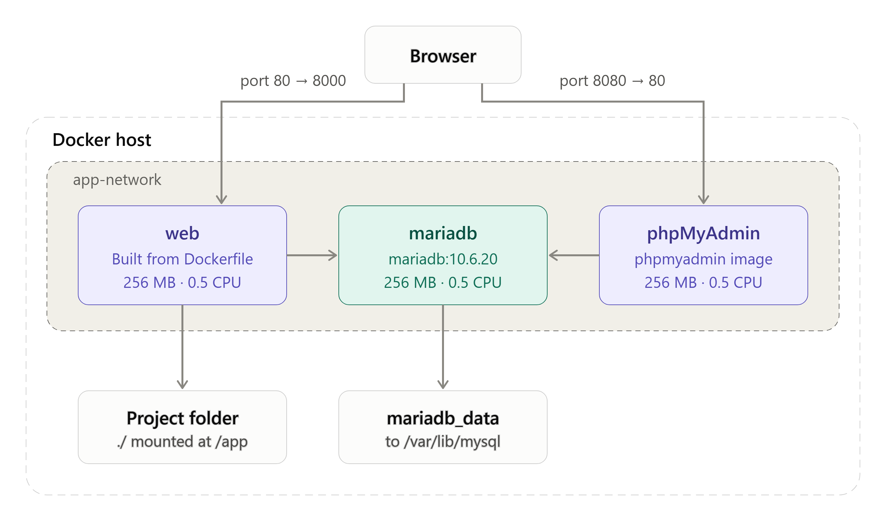
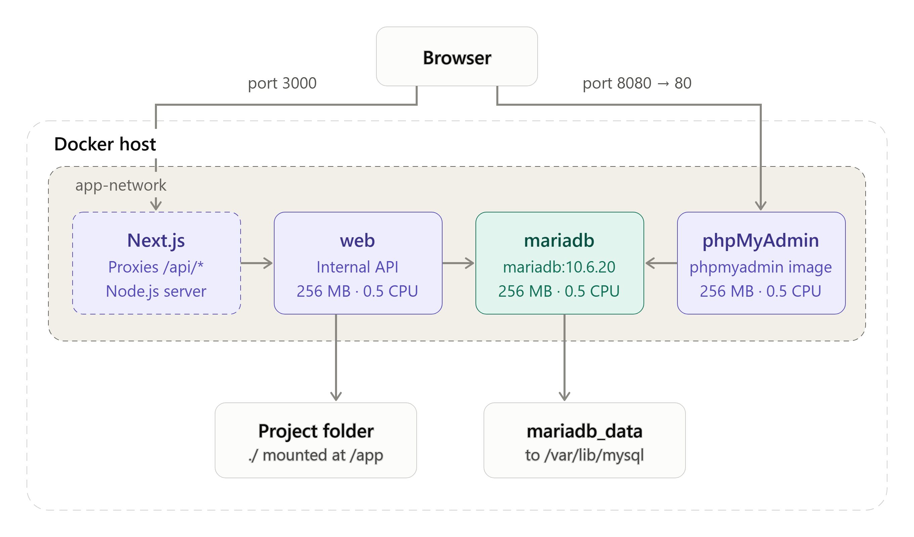

# 2026 Travel: Docker Project

A Dockerized version of a previous travel application, using **Flask**, **MariaDB** and **phpMyAdmin** running in three separate containers.

## Table of contents

- [Prerequisites](#prerequisites)
- [How to use](#how-to-use)
- [Overview](#overview)
- [Architecture](#architecture)
- [Running and stopping](#running-and-stopping)
- [Docker configuration](#docker-configuration)
- [Volumes and persistence](#volumes-and-persistence)
- [Networking](#networking)
- [Security and efficiency](#security-and-efficiency)
- [Testing and verification](#testing-and-verification)
- [Limitations and next steps](#limitations-and-next-steps)

## Prerequisites

1. Git
2. Docker Desktop

## How to use

1. Clone the Git project.
2. Create a `.env` file in the project folder (use `.env.example` as guidance).
3. In your terminal, navigate to the project folder.
4. Run:

   ```bash
   docker compose up --build
   ```

5. All containers should now be running and accessible through `localhost` (127.0.0.1):

   | Service | URL |
   |---|---|
   | Web application (Flask) | <http://localhost:8000> |
   | phpMyAdmin | <http://localhost:8080> |

6. Open phpMyAdmin in your browser (<http://localhost:8080>) and log in with the credentials you set in your `.env` file.
7. In phpMyAdmin, import the `2026_travel.sql` file into the database. The app should now be ready.

## Overview

This Docker project is based on a previous travel application, using Flask, MariaDB and phpMyAdmin, running in three different containers.

## Architecture



## Running and stopping

| Command | What it does |
|---|---|
| `docker compose up --build` | Builds the images from the Dockerfile and compose file, then starts the containers |
| `docker compose up` | Starts the containers that are already built |
| `docker compose up -d` | Same as above, but detached from the terminal |
| `docker compose down` | Stops and removes your running containers |
| `docker compose down -v` | Stops and removes your containers **and deletes the volumes (the database data)** |
| `docker compose ps` | Shows the running containers |
| `docker stats` | Shows the containers' resource consumption (RAM, CPU, etc.) |

## Docker configuration

### Dockerfile

The Dockerfile is the recipe for building the image used by the `web` (Flask) service. It is a **multi-stage build**: the file contains two `FROM` stages, and only the last one becomes the final image.

```dockerfile
FROM python:3.9-slim AS builder
RUN python -m venv /opt/venv
ENV PATH="/opt/venv/bin:$PATH"
COPY requirements.txt .
RUN pip install --no-cache-dir -r requirements.txt

FROM python:3.9-slim
RUN useradd --uid 10001 --no-create-home appuser
COPY --from=builder /opt/venv /opt/venv
ENV PATH="/opt/venv/bin:$PATH"
WORKDIR /app
COPY --chown=10001:10001 . .
USER 10001
CMD ["flask", "run", "--host=0.0.0.0", "--port=8000", "--debug", "--reload"]
```

#### Stage 1: builder

This stage only exists to install the Python dependencies. It is not part of the final image.

| Instruction | What it does |
|---|---|
| `FROM python:3.9-slim AS builder` | Starts from a small Python 3.9 base image from Docker Hub and names this stage `builder` so the next stage can copy from it |
| `RUN python -m venv /opt/venv` | Creates a virtual environment at `/opt/venv` to hold all installed packages in one folder |
| `ENV PATH="/opt/venv/bin:$PATH"` | Puts the venv first on the `PATH`, so `python` and `pip` refer to the venv versions |
| `COPY requirements.txt .` | Copies only the requirements file (not the whole project). Docker caches this layer, so dependencies are only reinstalled when `requirements.txt` changes, not on every code change |
| `RUN pip install --no-cache-dir -r requirements.txt` | Installs the dependencies into the venv. `--no-cache-dir` skips pip's download cache to keep the layer small |

#### Stage 2: final image

This stage starts from a fresh base image and only takes what it needs from the builder.

| Instruction | What it does |
|---|---|
| `FROM python:3.9-slim` | Starts a clean image. Nothing from stage 1 is included unless it is explicitly copied |
| `RUN useradd --uid 10001 --no-create-home appuser` | Creates an unprivileged user with a fixed UID (10001) and no home directory |
| `COPY --from=builder /opt/venv /opt/venv` | Copies the finished venv, with all installed packages, from the builder stage |
| `ENV PATH="/opt/venv/bin:$PATH"` | Sets the `PATH` again, because environment variables are not carried over between stages. This is what makes the `flask` command available |
| `WORKDIR /app` | Sets the working directory for the following instructions and for the running container |
| `COPY --chown=10001:10001 . .` | Copies the project files into `/app`, owned by the non-root user |
| `USER 10001` | Switches to the non-root user. Everything after this line, including the running container, runs as `appuser` instead of root |
| `CMD ["flask", "run", ...]` | The default command when the container starts. It runs the Flask development server on port 8000 |


#### Multi-stage build

The reason for splitting the build in two:

- **Smaller image:** the final image only contains the venv and the app, not the build leftovers from installing packages.
- **Better caching:** copying `requirements.txt` first means the slow dependency install is reused as long as the requirements haven't changed.
- **More secure:** the container runs as a non-root user with no home folder.

Note that the venv is created at the same path (`/opt/venv`) and with the same base image (`python:3.9-slim`) in both stages. This matters because a virtual environment contains absolute paths and is tied to the Python version that created it, so it must be copied into an identical environment to keep working.

Also, because `docker-compose.yml` mounts the project folder over `/app` (`.:/app`), the code the container actually runs at development time comes from your host folder, not from the files copied into the image.

### docker-compose.yml

- The compose file describes how to run one or more containers together: which images or Dockerfiles to use, ports, networks, volumes, environment variables, and so on.
- The Dockerfile is referenced in the compose file as a "custom image", whereas the other services (`mariadb` and `phpmyadmin`) are pulled as ready-made images from Docker Hub.

### Environment variables and configuration notes

- The compose file uses a lot of environment variables, referenced as `${VARIABLE_NAME}`. These must be defined in the `.env` file, as shown in `.env.example`.
- If any environment variable names are changed in `docker-compose.yml`, the same change must be made in `.env` to keep them consistent and for the build not to fail.
- Container names can be changed freely in `docker-compose.yml`.
- More CPU and memory can be assigned to the containers by changing the `cpus` and `mem_limit` values for each service.

## Volumes and persistence

- `mariadb_data` is the only named volume, so the database data persists through a shutdown.
- `volumes: - .:/app` mounts the project folder into the web container, so changes (for example in the code) are visible immediately without rebuilding the images.

## Networking

Starting the project creates the network and the three containers:

```text
 ✔ Network app-network              Created
 ✔ Container 2026_travel_mariadb    Created
 ✔ Container 2026_travel_flask      Created
 ✔ Container 2026_travel_phpmyadmin Created
```

Running `docker compose ps` shows which ports are published:

```text
NAME                     PORTS
2026_travel_flask        0.0.0.0:8000->8000/tcp, [::]:8000->8000/tcp
2026_travel_mariadb      3306/tcp
2026_travel_phpmyadmin   0.0.0.0:8080->80/tcp, [::]:8080->80/tcp
```

As seen in the architecture diagram, the network `app-network` connects the containers so they can talk to each other directly, using the service name as the hostname (for example `mariadb:3306`).

From the output above, we can see that the Flask and phpMyAdmin containers are published to the host, shown by the mapping with an arrow (`0.0.0.0:8000->8000/tcp`). The MariaDB container is not.

By leaving out MariaDB's `ports` in `docker-compose.yml`, its port is only reachable inside the Docker network.

## Security and efficiency

- **Non-root user:** the container is run by a dedicated user instead of root. This limits the damage if the container is compromised, since the user has far fewer privileges than root.
- **Multi-stage build:** keeps the final image small by leaving build tools out of it (see [Multi-stage build](#multi-stage-build)).

## Testing and verification

| Command | What it shows |
|---|---|
| `docker compose config` | The resolved compose file, including the environment variables used and the port mappings |
| `docker stats` | Live usage of the containers (RAM, CPU, block I/O). Try creating a new user in the application and watch the CPU usage go up on the DB container, or load the destinations |
| `docker compose ps` | That everything is running, and that MariaDB is `healthy` |
| `docker network inspect app-network` | The status of all containers attached to the network |
| `docker compose logs --tail=50 web` | The last 50 log lines from the web container, useful for any errors after `docker compose up` |

## Limitations and next steps

- **Frontend:** this project was deliberately chosen for its simplicity. A real use case would likely have a frontend running on its own port, for example Next.js in a separate container. It wouldn't need to access the database directly, but would call the Flask API, which connects to MariaDB.

  If we were to build something like that, we could remove the published Flask port (8000) and make the web API internal only:

  

- **Production server:** the Flask development server is fine for a demo, but it is slow and unsafe in production. We should use **gunicorn** and turn off debug mode, since it can expose code on errors.
- **Rootless Docker:** set up a rootless daemon instead of only using a non-root user. Normally both non-root and rootless are used for the highest security.
- **Database seeding:** users currently have to import the SQL file in phpMyAdmin every time the database is created, before they can use the application. A better approach would be a function in the Python code that automatically creates the tables and loads the data if they are empty.
- **Hosting:** if the application grew to a point where usage is high, a Linux server (Hetzner, Linode, DigitalOcean) could host the Docker containers. That would give close to 100% uptime for production and avoid using personal computer power.